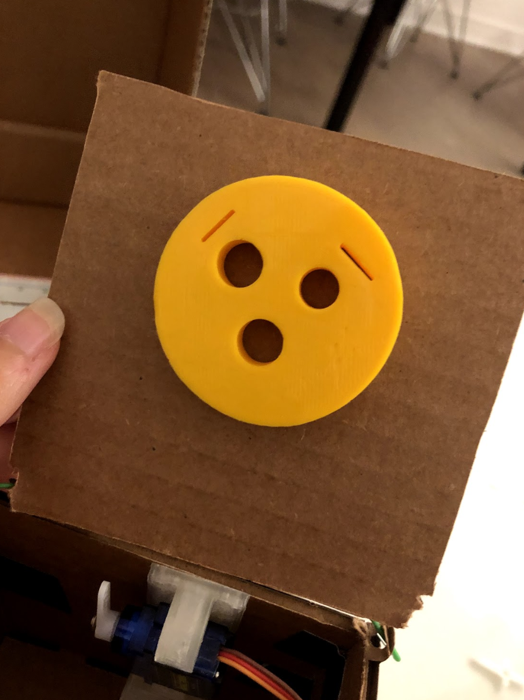
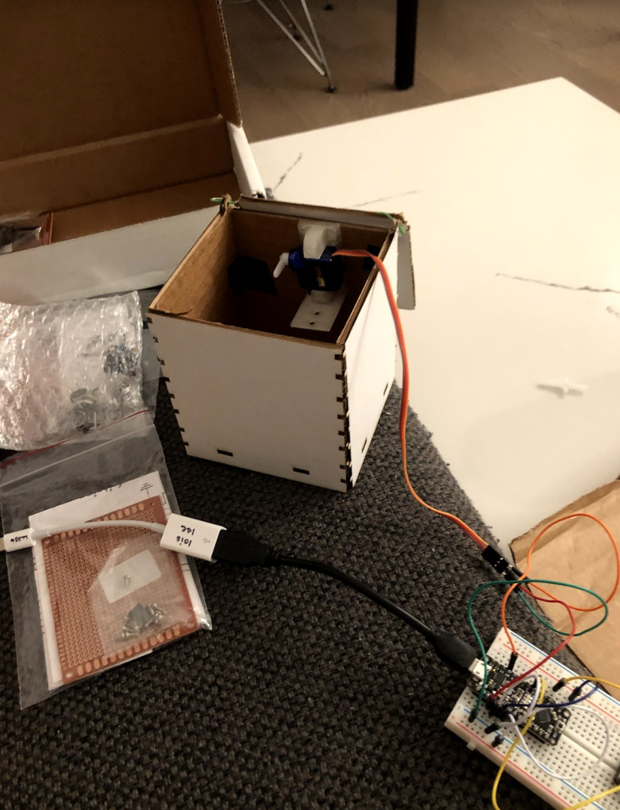
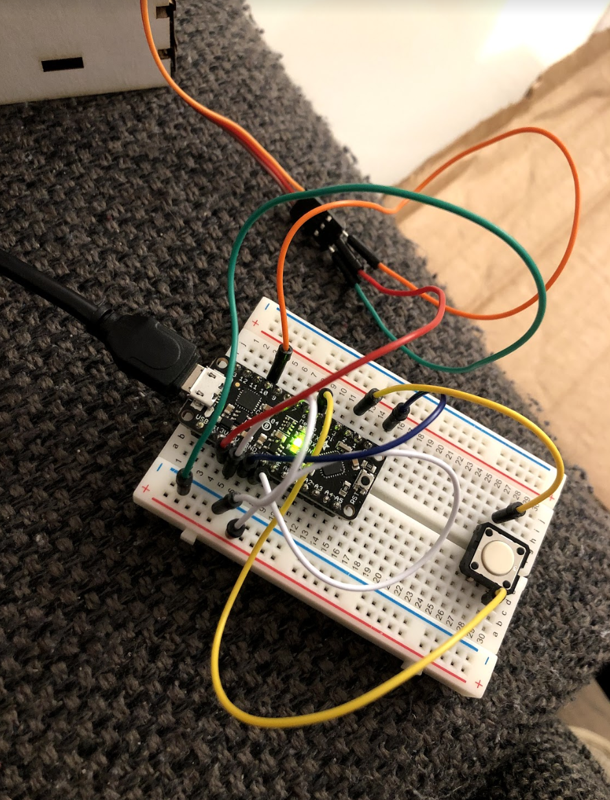
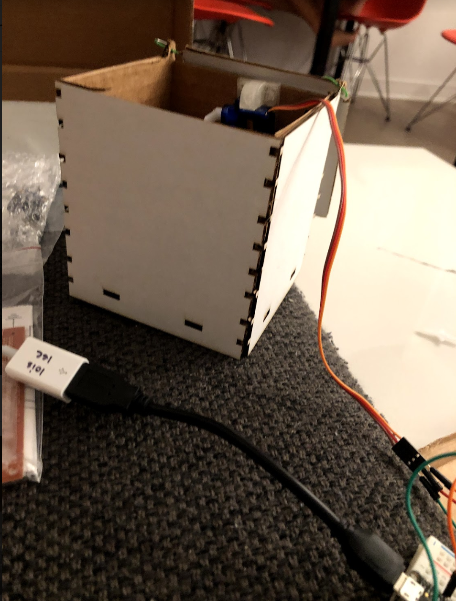

# Useless Box

## 3D Printing

**a. Include a photo of your printed part here.**

**b. Include `.stl` or `.svg` files for your bopper, if 3d-printing.**

[stl file](jack.stl)

## Laser Cutting

**b. Include a photo of your box here.**

## Electronics

**c. Upload code & a photo of your electronic circuit here.**

I used the provided code.
 

## Putting it All Together

Include here:
[Provided Arduino code](jack.ino)

[SVG File](jack.stl)

[Video Demo 1](https://drive.google.com/file/d/1mXYhE_CKGA1CBWbrzAKCItbYgy7E4cZE/view?usp=sharing)

[Video Demo 2](https://drive.google.com/file/d/1YU0JVW7glcSnH1a0vKTh06KeZkI0wlxF/view?usp=sharing)

